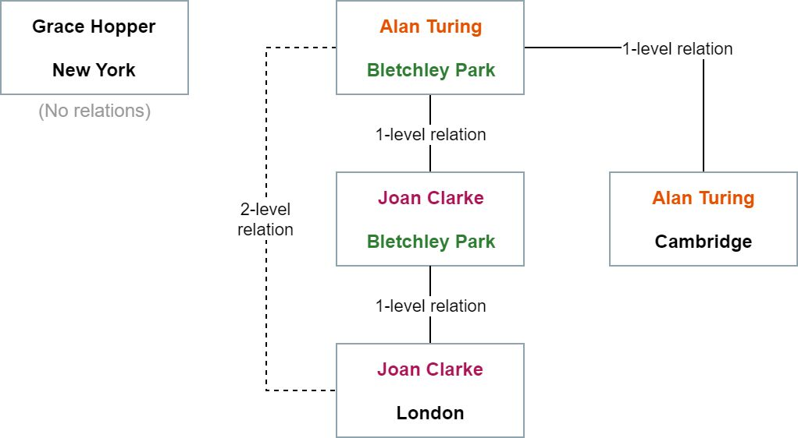

# relationsfinder
<<<<<<< Upstream, based on origin/main

=======
>>>>>>> 13ef9a2 README.md
Finds the minimal relation level between two people - shortest path in an unweighted graph

_A utility that finds the minimal relation level between two people._

The utility have the following functions:

	void Init(Person[] people) - Initialization of the utility with person instances.
	int FindMinRelationLevel(Person personA, Person personB) - Returns the minimal level of relation between personA and personB. 
	                                                           If they are not related, return -1.

The following classes define a person with a name and address:

	class Person
	{
		public Name FullName { get; set; }
		public Address Address { get; set; }
	}
	class Name
	{
		public string FirstName { get; set; }
		public string LastName { get; set; }
	}
	class Address
	{
		public string Street { get; set; }
		public string City { get; set; }
	}

* The above example is written in C#. 

* We define a direct relation between two people as follows: Person A is directly related to person B if either their full name and/or address are exactly equal (case-sensitive). 
* We define an n-level relation between person A and person B if you can reach from person A to person B in exactly n direct relation hops. 1-level relation is a direct relation.
